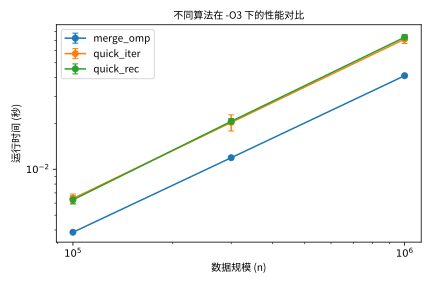
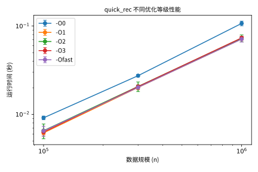
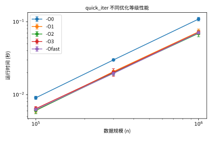
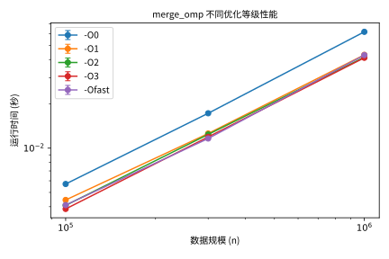
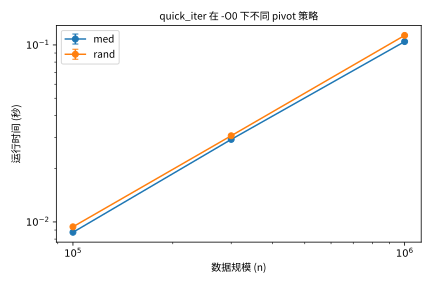
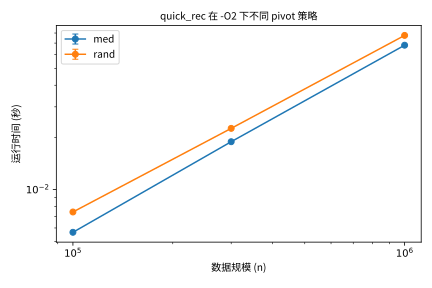
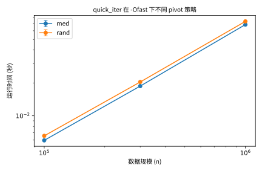
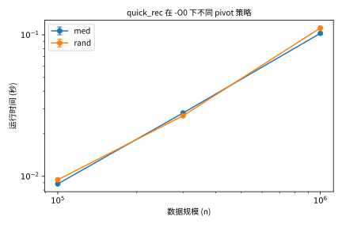

# NCUSCC2025秋季考核 - C语言试题实验报告

---

<span style="font-size:1.6em; font-weight:bold;">罗宇威</span>

---

<span style="font-weight:bold; font-size:1.6em;">考核要求</span>

---

1.安装虚拟机：
•  在虚拟机中安装 Ubuntu 22.04 LTS 操作系统。
•  配置虚拟机的网络连接，确保可以正常联网。
2.安装 C 语言编译器：
•  安装最新版本的 gcc（可通过 PPA 安装最新稳定版）。
•  验证编译器安装成功，并确保其正常工作。
3.实现排序算法：
•  使用 C 语言手动实现以下算法（不调用任何库函数）：
•  快速排序（递归 + 非递归版本）：基础排序算法，但需考虑 pivot 选择（如随机 pivot、三数取中）对性能的影响。
•  归并排序（并行化版本）：基于 OpenMP 实现并行归并排序（利用#pragma omp parallel等指令，将大数组分块后多线程处理）。
•  运行测试代码，确认各排序算法的正确性。
4.生成测试数据：
•  编写代码或脚本自动生成测试数据到单独的数据文档，程序运行的时候需体现从文档读取数据的过程（随机生成浮点数或整数）。
•  测试数据应覆盖不同规模的数据集，其中必须包含至少 100 000 条数据的排序任务。
5.编译与性能测试：
•  使用不同等级的 gcc 编译优化选项（如 -O0, -O1, -O2, -O3, -Ofast 等）对快速排序和归并排序代码进行编译。
•  记录各优化等级下的排序算法性能表现（如执行时间和资源占用）。
6.数据记录与可视化：
•  编写脚本收集每个编译等级的运行结果和性能数据。
•  分析算法的时间复杂度，并将其与实验数据进行对比。
•  将数据记录在 CSV 或其他格式文件中。
•  使用 Python、MATLAB 等工具绘制矢量图，展示实验结论。
7.撰写实验报告：
•  撰写一份详细的实验报告，内容应包括：
•  实验环境的搭建过程（虚拟机安装、网络配置、gcc 安装等）。两种排序算法的实现细节。测试数据的生成方法，以及收集实验数据的过程。不同编译优化等级下的性能对比结果。数据可视化部分（附图表）。实验过程中遇到的问题及解决方案。
•  报告必须采用 LaTeX 或 Markdown 格式撰写。
提交要求
•  将完整的实验报告和源代码上传至个人 GitHub 仓库。
•  提交报告的 PDF 文件及仓库链接。

---

<span style="font-size:1.6em; font-weight:bold;">实验报告正式部分</span>

---

<span style="font-weight:bold; font-size:1.3em;">一、实验环境的搭建</span>

<span style="font-weight:bold;">1、安装VMware，使用VMware创建虚拟机并安装Ubuntu 24.04.3 LTS操作系统</span>

（1）前往[VMware](https://www.vmware.com/products/desktop-hypervisor/workstation-and-fusion)官网下载VMware workstation（需要注册博通账号）

（2）前往[Ubuntu](https://cn.ubuntu.com/download/desktop)官网下载Ubuntu 24.04.3 LTS操作系统镜像


（3）在VMware中新建虚拟机，跟随引导安装下载好的Ubuntu 24.04.3 LTS.iso，进入虚拟机后点击桌面的Ubuntu 24.04.3 LTS进行系统安装

<span style="font-weight:bold;">2、配置网络，在VMware中点击编辑->虚拟网络编辑器，选择NAT模式，让虚拟机通过宿主机的网络对外访问</span>


<span style="font-weight:bold;">3、安装gcc</span>

（1）ctrl +alt+t 打开终端

（2）输入：

```bash
sudo apt update

sudo apt install build-essential

gcc --version
```

安装并验证gcc版本

---

<span style="font-weight:bold; font-size:1.3em;">二、快排（递归+非递归）和归并排序的实现</span>

<span style="font-weight:bold;">1、快排核心思想</span><span style="font-weight:bold;">（分而治之）</span>

​	1、选出一个基准数（pivot）：

​		<span style="font-size:0.7em;">三种策略 rand（随机）、med（看头中尾，取中位数）、last（直接用最后一个元素）</span>

​	2、把数组以基准数分为两边：比它大的放左边，比它小的放右边

​	3、对左右两边分别重复1.2步，如此往复直到整个数组有序

​     <span style="font-weight:bold;">快排实现细节</span>

​	1、先选pivot，将pivot放至区间末尾

​	2、设一个指针i指向左边区域边界

​	3、用j遍历，遇到不大于pivot的数就将其与i位置交换，同时i++

​	4、遍历结束后，将pivot换至i位置，此时及满足左边全是比pivot小的，右边全是比pivot大的

<span style="font-weight:bold;">1.1、快排（递归）</span>

```c
void quicksort_recursive(T* arr, long l, long r, pivot_t pt) {
    while (l < r) {
        long p = partition(arr, l, r, pt); // 分区
        if (p - l < r - p) {
            if (l < p) quicksort_recursive(arr, l, p - 1, pt); // 先排左边
            l = p + 1; // 再排右边
        } else {
            if (p + 1 < r) quicksort_recursive(arr, p + 1, r, pt); // 先排右边
            r = p - 1; // 再排左边
        }
    }
}

```

递归就是自己调用自己，体现核心思想中的第三步重复

编写并使用partition函数进行划分

<span style="font-weight:bold;">1.2、快排（非递归）</span>

```c
void quicksort_iterative(T* arr, long n, pivot_t pt) {
    typedef struct { long l, r; } Range;
    Range* stack = malloc(n * sizeof(Range));
    long top = 0;
    stack[top++] = (Range){0, n - 1};

    while (top) {
        Range cur = stack[--top];
        long l = cur.l, r = cur.r;
        while (l < r) {
            long p = partition(arr, l, r, pt);
            if (p - l < r - p) {
                if (p + 1 <= r) stack[top++] = (Range){p + 1, r};
                r = p - 1;
            } else {
                if (l <= p - 1) stack[top++] = (Range){l, p - 1};
                l = p + 1;
            }
        }
    }
    free(stack);
}

```

非递归版本使用数组模拟的手动维护栈保存待处理区间

每次从栈中取一个区间进行划分（同样使用partition函数），再将划分出的左右子区间放回栈中

对比递归版在面对更大规模的数据时能避免爆栈

---

<span style="font-weight:bold;">2、并行归并排序核心思想（分而治之+合并）</span>

​	1、将数组递归拆分为两半，分别排序并合并

​	2、使用OpenMP task 并行化左右子区间排序，充分利用多核CPU（并行）

​	3、小区间（<=32）直接用插入排序，减少递归开销

​    <span style="font-weight:bold;">归并排序实现细节</span>

​	（不考虑小区间使用插入排序优化时）	

​	1、重复对半拆，拆至单个元素（天然有序）停止

​	2、重复合并，1->2->4->8......

​	3、合并过程：

​		A、在两区间各放一个指针

​		B、比较两个指针指向的数，谁小谁先放进结果数组，同时该指针后移

​		C、重复A、B，直到一边被用完

​		D、把剩下的（最大值）直接放至结果数组最后

```c
static void merge(T* arr, T* tmp, long l, long m, long r) {
    long i=l, j=m+1, k=l;
    while (i<=m && j<=r) tmp[k++] = (arr[i]<=arr[j]) ? arr[i++] : arr[j++];
    while (i<=m) tmp[k++] = arr[i++];
    while (j<=r) tmp[k++] = arr[j++];
    for (long x=l; x<=r; x++) arr[x] = tmp[x];
}

static void mergesort_parallel_internal(T* arr, T* tmp, long l, long r, int depth) {
    if (r - l <= 32) { insertion_sort(arr, l, r); return; }
    long m = l + (r - l) / 2;
    if (depth > 0) {
        #pragma omp task shared(arr, tmp)
        mergesort_parallel_internal(arr, tmp, l, m, depth - 1);
        #pragma omp task shared(arr, tmp)
        mergesort_parallel_internal(arr, tmp, m + 1, r, depth - 1);
        #pragma omp taskwait
    } else {
        mergesort_seq(arr, tmp, l, m);
        mergesort_seq(arr, tmp, m + 1, r);
    }
    merge(arr, tmp, l, m, r);
}

```

---

<span style="font-weight:bold; font-size:1.3em;">三、测试数据的生成</span>

<span style="font-weight:bold;">1、实验目标</span>

​	编写数据生成程序，通过程序获得大规模数据文件，对上述排序算法进行性能测试

<span style="font-weight:bold;">2、实验思路</span>

​	1、生成随机数：使用rand（）函数生成随机整数

​	2、文件输出：将数据写入文本文件，每行一个整数

​	3、文件管理：将数据文件存至data/文件夹下，便于管理调用

​	

```C
#include <stdio.h>
#include <stdlib.h>
#include <time.h>
#include <string.h>
#include <sys/stat.h>
#include <sys/types.h>

int main(int argc, char* argv[]) {
  if (argc < 3) {
    printf("用法: %s <文件名> <数据量>\n", argv[0]);
    printf("示例: %s dataset_1e5.txt 100000\n", argv[0]);
    return 1;
  }

  const char* filename = argv[1];
  long n = atol(argv[2]);

  // 确保 data 目录存在
  struct stat st = {0};
  if (stat("data", &st) == -1) {
    mkdir("data", 0755);
  }

  // 拼接路径 data/filename
  char path[256];
  snprintf(path, sizeof(path), "data/%s", filename);

  FILE* f = fopen(path, "w");
  if (!f) {
    perror("打开文件失败");
    return 1;
  }

  srand((unsigned)time(NULL));

  for (long i = 0; i < n; i++) {
    long val = ((long)rand() << 32 | rand()) % 2000000001L - 1000000000L;
    fprintf(f, "%ld\n", val);
  }

  fclose(f);
  printf("已生成 %ld 条数据到 %s\n", n, path);
  return 0;
}

```


<span style="font-weight:bold;">3、使用方法</span>

编译：

```bash
gcc -O2 -o gen_data gen_data.c
```

生成 10 万条数据：

```bash
./gen_data dataset_1e5.txt 100000
```

生成 100 万条数据：

```bash
./gen_data dataset_1e6.txt 1000000
```

生成的数据会保存在 `data/` 目录下，例如 `data/dataset_1e5.txt`

---

<span style="font-weight:bold; font-size:1.3em;">四、性能测试及性能表现收集和可视化</span>

<span style="font-weight:bold;">1、实验变量：</span>

​	1、算法种类：

​		<span style="font-size:0.9em;">快排（递归或非递归）、并行归并</span>

​	2、编译优化等级

​		<span style="font-size:0.9em;">-O0：完全不优化</span>

<span style="font-size:0.9em;">		-O1：小优化，去掉部分无用代码</span>

<span style="font-size:0.9em;">		-O2：常用等级，开启大部分优化</span>

<span style="font-size:0.9em;">		-O3：更激进的优化（如自动向量化），可能导致代码体积变大</span>

<span style="font-size:0.9em;">		-Ofast：在-O3基础上再放开一些限制（如浮点数精度）</span>

​	3、测试数据规模

​		<span style="font-size:0.9em;">1e5，3e5，1e6</span>

​	4、pivot选择策略（仅对于快排）

​		<span style="font-size:0.9em;">med、rand</span>

<span style="font-weight:bold;">2、自动化数据收集脚本和数据可视化工具的编写</span>

​	<span style="font-weight:bold;">1、自动化脚本</span>

​	1.1、需完成的任务：

​		1、编译数据生成器 `gen_data.c`，生成不同规模的数据集（1e5、3e5、1e6 条数据）。

​		2、循环不同的编译优化等级（`-O0, -O1, -O2, -O3, -Ofast`）。

​		3、对三种算法（递归快排 `quick_rec`、非递归快排 `quick_iter`、并行归并 `merge_omp`）进行测试。

​		4、对快排类算法，测试不同 pivot 策略（`rand`、`med`）。

​		5、将运行结果（运行时间、是否排序正确、线程数等）统一写入 `build/results.csv`

​	1.2、自动化脚本核心片段

```bash
for opt in -O0 -O1 -O2 -O3 -Ofast; do
  gcc $opt -fopenmp src/sort.c -o build/sort
  for ds in data/dataset_1e5.txt data/dataset_3e5.txt data/dataset_1e6.txt; do
    size=$(wc -l < "$ds")
    for algo in quick_rec quick_iter merge_omp; do
      pivots=("na")
      if [[ "$algo" != "merge_omp" ]]; then
        pivots=("rand" "med")
      fi
      for pv in "${pivots[@]}"; do
        line=$(./build/sort "$algo" "$ds" "$pv")
        time=$(echo "$line"  | grep -oP 'time_sec=\K[0-9.]+')
        sorted=$(echo "$line" | grep -oP 'sorted=\K[0-9]+')
        echo "$opt,$algo,$pv,$ds,$size,$time,$sorted,$OMP_NUM_THREADS" >> "$OUT"
      done
    done
  done
done

```

​	1.3、输出结果

格式：

```
opt,algo,pivot,dataset,size,time_sec,sorted,threads
```

示例：

```
-O3,quick_iter,rand,data/dataset_1e5.txt,100000,0.012345,1,4
```

解读：

-O3优化等级编译，快排（非递归），pivot策略为rand，测试数据为10w条，排序耗时0.012345s，排序正确（sorted=1），环境变量为4线程


​	<span style="font-weight:bold;">2、结果可视化工具编写</span>

​	2.1、思路

​		1、数据准备：run_bench产生的results.csv(筛选出sorted=1的结果)

​		2、使用Python的pandas进行数据处理，matplotlib绘制折线图

​		3、控制变量进行对比图绘制

​	2.2、核心片段

```python
# 图1：不同算法在 -O3 下的性能对比
sub = df[df["opt"] == "-O3"]
plot_with_errorbar(
    sub, "algo",
    "不同算法在 -O3 下的性能对比",
    "report/figs/all_algos_O3.svg",
    "数据规模 (n)", "运行时间 (秒)"
)

# 图2：每个算法在不同优化等级下的性能
for algo in df["algo"].unique():
    sub = df[df["algo"] == algo]
    if sub.empty: continue
    plot_with_errorbar(
        sub, "opt",
        f"{algo} 不同优化等级性能",
        f"report/figs/{algo}_opts.svg",
        "数据规模 (n)", "运行时间 (秒)"
    )

# 图3：快排在不同 pivot 策略下的性能
for algo in df["algo"].unique():
    for opt in df["opt"].unique():
        sub = df[(df["algo"] == algo) & (df["opt"] == opt)]
        if sub.empty or sub["pivot"].nunique() <= 1: continue
        plot_with_errorbar(
            sub, "pivot",
            f"{algo} 在 {opt} 下不同 pivot 策略",
            f"report/figs/{algo}_{opt}_pivot.svg",
            "数据规模 (n)", "运行时间 (秒)"
        )

```

​	2.3、遇到问题

​			Q1：用apt安装matplotlib和pandas失败

​			Q2：Matplotlib默认字体不支持中文，导致图标标题乱码

​		问题解决

​			A1：使用虚拟环境+pip进行安装

​					确保有虚拟环境工具：

​					`sudo apt install -y python3-venv`

​					在项目目录下创建并激活虚拟环境：

​					`python3 -m venv venv`
​					`source venv/bin/activate`

​					在虚拟环境里安装需要的库：

​					`pip install pandas matplotlib`

​			A2：手动指定NotoSansCJK字体，确保中文正常显示

---

<span style="font-size:1.3em; font-weight:bold;">五、实验分析和结论展示</span>

​	<span style="font-weight:bold;">1、快排，归并排序时间复杂度分析</span>

​	1.1、快排时间复杂度分析

​		最好情况：每次pivot都能将数组均匀分成两半

​			递归深度：log<span style="vertical-align:sub;">2</span>n

​			每次都要遍历所有元素：n

​			总复杂度：O(nlogn)（Ω(nlog⁡n)）

​		平均情况：随机选择pivot，平均能得到比较均衡的划分

​			复杂度仍为O(nlogn)（忽略了常数因子2）

​		最坏情况：pivot每次都选到最值

​			递归深度：n

​			每次都要遍历所有元素：n

​			总复杂度：O(n<span style="vertical-align:super;">2</span>)

​	1.2、归并排序时间复杂度分析

​		在任何情况下都是相同过程

​		重复对半拆分过程：log<span style="vertical-align:sub;">2</span>n

​		每层合并都需要遍历所有元素：n

​		总复杂度：O(nlogn)

​	<span style="font-weight:bold;">2、测试数据可视化展示</span>

​	2.1、不同算法在 -O3 下的性能对比



​	2.2、每个算法在不同优化等级下的性能

​		快排（递归）



​		快排（非递归）



​		并行归并排序



​	2.3、快排在不同 pivot 策略（med、rand）下的性能（展示部分)	









​	<span style="font-weight:bold;">3、结论</span>

​		1、归并排序明显好于快排，快排递归与否差距不大

​		2、-O1，-O2，-O3，-Ofast明显好于-O0，但各优化等级之间差距不明显

​		3、pivot策略med通常好于rand，但也有例外

---

